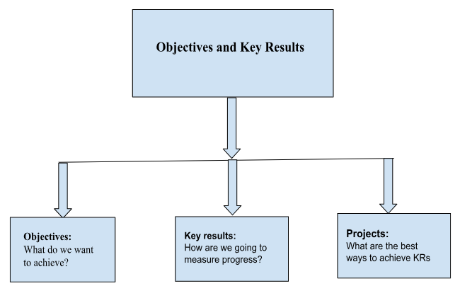
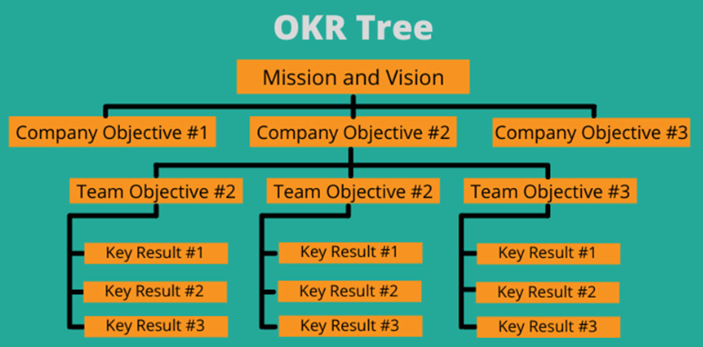

## **Introduction**

The process of aligning the entire organization with the company's vision is a common challenge. Using OKRs as a goal-setting framework helps organizations define objectives and then track outcomes in days instead of months. The Objectives and Key Results framework was initially framed by the KansoCloud co-founders Govind Bangarbale, Pramod Verrannagri, and Sanket Dangi in 2021. As a CEO at Intel, Andy Grove took the idea of MBO from Peter Drucker and upgraded it with the concept of Key Results. Thus, OKRs were born, and Andy Grove became the father of the OKR framework. OKRs are nothing but a simple goal-setting framework that can help employees, groups, and organizations to set ambitious, clear, and specific objectives and take quantifiable steps to achieve them which will help them contribute towards the success of the company as a whole.
 
There can be many factors that contribute to a company’s success and OKRs (if implemented in the right spirit) can certainly assist in this regard. The management of a company chooses to implement this technique for the overall growth of the organization. Companies big and small have implemented OKRs with varying degrees of success but the more successful ones such as Google have embodied this culture and constantly adapted to make it work within their system. This blog post discusses our challenges at KansoCloud in implementing OKRs across the organization.
 

## **OKR Guidelines at KansoCloud:**

<ul>
  <li>OKRs are a goal-setting framework used to define measurable goals and track their outcomes</li>
    <ul>
        <li><strong>Objectives</strong> -  what do we want to achieve?</li>
        <li><strong>Key Results</strong> -  how are we going to measure progress?</li>
    </ul>
    <li>
        OKRs should align with KansoCloud’s business goals and initiatives, with regular check-ins to gauge progress every quarter
    </li>
    <li>
        OKRs usually contain 3-4 high-level objectives, with another 2-3 key measurable results (KRs) for each objective
    </li>
    <li>
        OKRs can clearly make the objective achievable and should always be quantifiable and measurable. Key results also lead to the grading of the objectives.
    </li>
</ul>

For Example:
<strong>Objective</strong>: Improve the recruitment and hiring process
<strong>Key Result</strong> 1: Hire at least 3 DevOps Engineers and 3 Senior DevOps Engineers in Q1
<strong>Key Result</strong> 2: Push them to complete at least on certification related to their project within 3 months of their joining

<!-- images need to be shown here -->

  

    
  

  

    
  

## **Benefits of using OKRs:**

<ol>
    <li>
        <strong>Goal Alignment:</strong>
        OKRs facilitate goal alignment at the individual, team, and organizational levels. Organizations can learn more about how well this alignment is accomplished and whether it adds value to the overall organizational effectiveness by conducting one-on-one sessions with the team.
    </li>
    <li>
        <strong>Prioritization and Focus:</strong>
        By encouraging organizations to create precise, well-defined goals, OKRs assist teams in concentrating on the things that count. Investigating OKRs can reveal how well a team is able to focus on extremely demanding projects and adhere to its initiatives.
    </li>    
    <li>
        <strong>Measurable Outcomes:</strong>
        An essential element of OKRs is their focus on outcomes that are quantifiable. The analysis enables companies to assess the usefulness of tracking developments and determining outcomes through quantitative measurements
    </li>    
    <li>
        <strong>Learning and Adaptability:</strong>
        OKRs promote a culture of adaptability and learning. Organizations can evaluate how successfully they are accepting change, growing from challenges, and strengthening their goal-setting procedures through analysis.
    </li>    
    <li>
        <strong>Employee Motivation and Engagement:</strong>
        By giving employees an unambiguous objective and orientation, OKRs can improve employee engagement. Organizations can evaluate how successfully the structured process is connecting with the employees by looking into how OKRs affect job satisfaction and employee motivation.
    </li>    
    <li>
        <strong>Communication and Transparency:</strong>
        By making goals visible to all members of the organization, OKRs encourage direct interaction and accountability. The successful execution of information flow between various organizational levels and how effective communication can reduce the gaps/blockers within the organization can also be assessed through analysis.
    </li>    
    <li>
        <strong>Alignment with Organizational Strategy:</strong>
        OKRs are meant to be in complete accordance with the organization's strategic plan. Organizations can determine whether goals at various levels are supporting their ultimate strategic goals by reviewing OKRs.
    </li>    
    <li>
        <strong>Agility and Adaptability:</strong>
        Flexible scenarios are excellent work for OKRs. Examining how OKRs are implemented can reveal how well companies adjust to the changing needs of customers, market conditions, and other external stimuli.
    </li>    
    <li>
        <strong>Data-Driven Decision-Making:</strong>
        OKR evaluation is dependent on metrics and data. Examining OKRs inside an organization can reveal how deeply embedded data-driven decision-making is in the culture of the company.
    </li>    
    <li>
        <strong>Continuous Improvement:</strong>
        OKRs are frequently used as part of regular monitoring and feedback sessions to promote continuous improvement. Organizations can use this method to determine how effectively they are utilizing these procedures for future growth.
    </li>
</ol>

## **Findings**

<ul>
    <li>
        The findings on OKRs say that at the individual, team, and organizational levels, OKRs help to align goals. By conducting OKR sessions, organizations can find out more about how successfully this consistency is achieved and whether it increases the overall efficiency of the organization.
    </li>
    <li>
        The OKRs help teams focus on the important things by motivating them to set clear, well-defined goals. Examining OKRs can show how well a team can focus on really difficult projects and follow through on its goals.
    </li>
    <li>
        A fundamental component of OKRs is their emphasis on measurable results. Through analysis, businesses can evaluate the value of tracking changes and measuring quantitatively to determine results.
    </li>
    <li>
        OKRs encourage a culture of agility and learning. Through analysis, organizations may assess how well they are embracing change, learning from setbacks, and fortifying their goal-setting processes.
    </li>
    <li>
        OKRs should align perfectly with the strategic plan of the company. By examining OKRs, organizations can figure out whether objectives at different levels complement their overall strategic goals.
    </li>
    <li>
        Analyzing the application of OKRs can show how well businesses adapt to changing customer needs, market dynamics, and other outside influences.
    </li>
    <li>
        Data and metrics are necessary for evaluating OKRs. Analyzing OKRs within an organization can show the way deeply rooted data-driven decision-making is in the organization's culture.
    </li>
    <li>
        OKRs are commonly used to support continuous improvement whenever combined with routine monitoring and feedback sessions. 
    </li>
    <li>
        Assessing employee performance and determining the root cause or causes, of performance problems can be immediately addressed with a suitable learning program.
    </li>
    <li>
        The process of tracking the overall goals that are set for the business and its employees can be greatly aided by goal planning.
    </li>
</ul>

## **Conclusion**

OKRs should be typically set on a quarterly basis and should be measurable. The management should communicate OKRs very accurately and everyone should know the impact of why and what is important. OKRs are set at individual, team, and company levels and should be publicly available to the entire company and should be graded every quarter. Implementing OKRs usher in disciplined-thinking among employees. In our experience, having everyone focus on their OKRs on a regular basis provides for the best possible outcomes. Employee OKR data can be collected via Google Forms, spreadsheets, or any other tool where employees can also track OKRs should be typically set on a quarterly basis and should be measurable. The management should communicate OKRs very accurately and everyone should know the impact of why and what is important. OKRs are set at individual, team, and company levels and should be publicly available to the entire company and should be graded every quarter. Implementing OKRs usher in disciplined-thinking among employees. In our experience, having everyone focus on their OKRs on a regular basis provides for the best possible outcomes. Employee OKR data can be collected via Google Forms, spreadsheets, or any other tool where employees can also track the responses shared. Company-wide quarterly meetings should be conducted to grade last quarter’s OKRs progress and employees should be able to complete at least 60% - 70% overall grading in a quarter. In general, transparently sharing the grading information regarding OKR completion by leadership tends to foster a culture of openness in discussing OKR results among employees. After all, that is the best way to align everyone in an organization to make progress on share objectives.

## **References**

<!-- 1 -->

[OKR History](​​https://okrframework.org/en/okr-blog/okr-history)

<!-- 2 -->

[Rise of OKRs](https://www.leapsome.com/blog/the-rise-of-okrs-a-short-history-of-objectives-and-key-results)

<!-- 3 -->

[OKR FAQ](https://okrfaq.com/introduction-to-okrs/whats-the-history-of-okrs-when-and-how-did-okrs-get-started/)

<!-- 4 -->

[Dos and Don’ts for Setting OKRs](​​https://lisabrownpm.medium.com/dos-donts-and-must-haves-for-setting-okrs-ba0e4a8a39fd)
