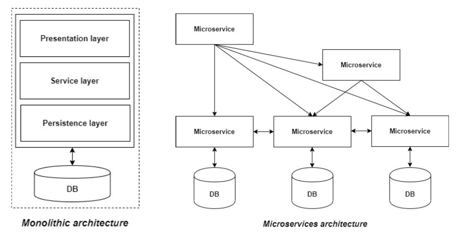

## **A Software Architect’s Dilemma!**

## **Introduction**

The right software design approach has always been an art rather than a science from the first time software applications were designed and developed. In general, the software development process has evolved based on mistakes from the past and limitations of the methodologies used. Tools have evolved, new frameworks created, design best practices adopted all to make scalable, extensible, and sustainable applications. Despite all this progress, software architects and designers always face a dilemma in deciding on the best approach to design a system.
 
While there have been efforts towards standardization by identifying common problems and creating repeatable solutions, every solution has its driving factors, targeted problems, and applicable solutions. The success of any architectural design depends on identifying the closest fit to a design principle and applying the principle to elegantly solve the problem at hand.
 
Application architectures can be categorized as <strong> Monolithic</strong> or <strong> Microservices</strong> architecture at a high level.
 

<!-- images need to be here -->

    

## **Monolithic Architecture**

An application can be considered monolithic if most of its functionality exists in a single codebase. The application is designed/implemented in different layers of abstraction such as Presentation, Service, and Persistence and then deployed as a distribution. Monolithic application, where “mono” represents the single codebase containing all the necessary functionalities.
 
In a monolithic architecture, since all the functionality and components exist and interact within the same executable instance, it typically requires additional design cadence. This in turn puts immense pressure on making the application understandable and changeable by individuals, not teams. In addition, distribution and managing the pace of such application development become relatively difficult.
 

<strong>Pros of Monolithic Architecture</strong>

<ul>
    <li>Since all application components are tightly connected using the same technology stack, it simplifies the implementation of business transactions that require the chaining of multiple components to produce a result. </li>
    <li>Since there is a single data persistence layer communicating with the database, typical database-related issues such as concurrency, and deduplication are relatively simpler compared to distributed systems</li>
    <li>Build and Deployment process remain simple (though more time consuming)</li>
    <li>Better control over interactions between different application components</li>
</ul>

## **Microservices Architecture**

Microservices architecture came into being a few years primarily because of the pressure on application developers to meet large scale digital transformation initiatives as well as the demand on businesses to accelerate time-to-market.
 
In order to deliver business value, an extensive portfolio of applications and integrations interacting with other vendors and technology partners supporting the business has become a necessity. The numerous touch points and interactions will eventually need considerable maintenance. So, the focus moved from delivering product features to dealing with internal and external dependencies coherently.
 
The concept of Microservices Architecture was born in order to elegantly handle this dependency issue. Microservices architecture dictates that the application is a collection of smaller services that can technically handle a specific functionality and data. Services can achieve their outcome by communicating with each other directly using lightweight protocols such as HTTP/HTTPS. According to Sam Newman, Microservices can be defined as “small services that work together” .
 

#### **Microservices Principles**

<ul>
    <li>
        <strong>Single Responsibility:</strong> This comes from the SOLID Design principles,  that a single unit, either a class, a method, or a microservice should have one and only one responsibility. Each microservice must have a single/specific responsibility and provide a single/specific functionality
    </li>
    <li>
        <strong>Built around Business Capabilities:</strong>There will always be multiple features in an application and every feature may have a different need, different technology that best suits the need. This principle means each microservice can use different technology based on the business requirements. For example an analytics engine in the application can probably make use of Python which is better equipped to handle calculations, but a userdata input service may have a User Interface and a simple backend framework.
    </li>
    <li>
        <strong>Design for Failure:</strong>As compared to a Monolithic architecture, Microservices must be designed with failure/connectivity cases in mind. Microservices must also exploit the advantage of this architecture and disruption of a microservice should not affect the system as a whole (other functionalities must remain accessible to the application user).
    </li>
</ul>

## **Microservices Architecture - Concerns**

With all these benefits promised by a Microservices based architecture, the question is what is not being adopted on a large scale. Implementing these patterns that may work for larger organizations but may not work for smaller organizations since it requires dedicated teams to assume ownership of specific services. It is essential to evaluate the current state, core functionality of the application and future state of the application before making a choice. Simple problems may eventually need simple solutions. Premature conversion of application to a Microservices architecture may end up creating operational overheads, and would need skilled resources who can understand the entire architecture to maintain it.
 
Here are some things to consider before making the decision to jump into a Microservices architecture:

<ul>
    <li>Computing should never be distributed, or at least avoided as much as possible. A logical transaction in the application should typically not cross the boundaries of the container. Every service should be complete in itself and designed to have single/specific responsibility. Can the application under consideration be distributed to work elegantly?</li>
    <li>When  a collaboration between objects is converted to a collaboration between systems, the application needs to deal with a myriad of liabilities and failure states. It is important to think through and planned most of these in order for a successful deployment in production.</li>
    <li>What is the plan to handle failures and network errors? What if a service is not reachable, how do we keep the remaining  application components running? Would absence of a service impact the entire application?</li>
    <li>Maintaining multiple codebases, multiple teams and running multiple services, ensuring their uptime requires dedicated large teams.</li>
    <li>In case of cloud deployments, vendor lock-in with cluster solution providers (EKS, ECS, AKS etc).</li>
    <li>CI/CD alignment - Multiple services would need multiple CI/CD pipelines and an efficient strategy to manage versions across multiple services within the application. </li>
    <li>Troubleshooting - Going through logs generated by multiple services at multiple locations may be challenging to troubleshoot, as compared to single log files in a monolith application. Do the support teams have the skill set and experience to handle this task?</li>
</ul>

## **Microservices Adoption - a contrarian example**

Recently, the Prime Video team at Amazon published a remarkable case study on their decision to do away with their Serverless and Microservices architecture by replacing it with a monolith instead. This created a buzz in the software developer community when people started to wonder if the Amazon developers were really following the appropriate path.
 
An important lesson from Prime Video’s pivot away from Microservices is, there’s no such thing as a one-solution-fit-all in technology. Every decision needs to be made on a case-by-case basis (“horses for the courses”).
 

## **Microservices Architecture - Use Case Review**

#### **Use Case: User Interface (UI) needs modernization**

This is a situation where an existing monolithic application requires a UI makeover. It may be tempting to think of creating a new UI service to act as frontend and separate it from the rest of the applications. In such cases, there is no practical need to take the microservices route. Adding a modern UI layer on top of the existing code base would probably be an easier fix that can be maintained with the existing team.
 

#### **Use Case: A specific part(s) of the core system needs requires a revamp**

In this use case, there are part(s) of the core system that still have valid functionalities but some components are obsolete or no longer valid. In such situations the application needs to be evaluated on how the obsolete content can be extracted out. If it is not directly connected to the core functionality, it may be a good idea to start breaking the application into services, and the obsolete part be replaced with a new component in a new service.
 

#### **Use Case: Multiple Repeatable applications with a need os reuse**

Once an organization or business reaches a certain scale and/or maturity level, there may be a need to standardize applications in the portfolio (to optimize software and support costs). Or there may be instances where certain components are required across different business functions/applications. This is probably a good use case for modularizing and reusing components. In such cases adopting a Microservices based architecture may help support reusability and save efforts on each individual team implementing the same business functionality from scratch.
 

#### **Use Case: Large Organization with Independent teams**

When the application grows organically with the business and the software development and support teams have to grow exponentially to support the larger scale, adopting a Microservices based architecture might be the right direction. Decoupling the teams , their release cycles, managing their individual roadmaps assist with efficiently delivering the required business outcomes.
 

## **Conclusion**

Monolithic applications will comprise application components that are tightly coupled using the same technology stack, giving more control over the dataflow and execution. But the tradeoff is clearly on the generated dependencies that become more difficult to deal with increased system complexity. Also, this architecture does not lend itself well to scaling the solution due to code complexity as well as increased deployments times.
 
In a Microservices based architecture, application features are composed by invoking self-contained services. These can be implemented by different teams at their own pace, scale independently, thereby reducing the overall complexity of the solution. But then they require a considerable amount of effort and money to maintain data consistency and handle communication issues.
 
Both these architectures have their own benefits and disadvantages. So decisions should be made based on the best fit considering the size, future roadmap, existing application structure, associated support costs along with the business requirements. Monolithic architecture may have scaling challenges when applications grow beyond a certain size, but it can jumpstart rapid application development in a way that microservices cannot.
 
