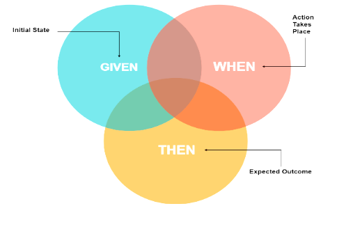
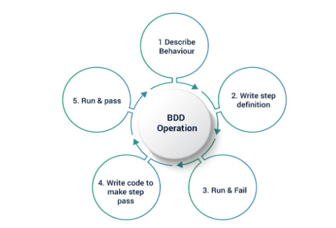
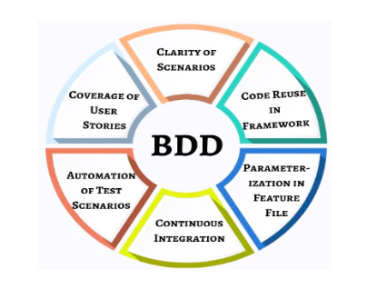

## **Introduction**

<strong>BDD</strong> Framework is a software development approach that allows testers, developers, and businesses to create specifications for a feature in simple text language (English) and link them directly to the code supporting the specific functionality.

## **Why Use BDD?**

BDD is an approach to write specifications and not just tests. Using the BDD framework reduces rework and increases reusability of code. In the traditional testing approach, usage of TDD and Unit testing is quite common. It tends to be monotonous to a certain extent since the same code is created multiple times to cover the same functionality. BDD Framework allows the tester to reuse test cases and step definitions multiple times. When compared to the traditional approach, BDD facilitates the creation of fewer tests thereby saving effort and time.

## **How does BDD Work?**

In the BDD framework, feature files are initially created to describe the main feature or functionality for a particular scenario, and test cases are then invoked from inside step definitions. Discussed below is a simple example of login functionality using BDD.

 **Feature** :  **Login** 
 
**As a user**,
 
**I want to log in to my account, to access my profile and settings features.**

 **Scenario 1** : **As a user, I want to try to log in with valid credentials provided**  
 **Given I**  **am on the login page**  
 **When I**  **enter valid credentials and I click on the login button**  
 **Then I**  **should be logged in to my account**  

 **Scenario 2** : **As a user, I want to try to login with invalid credentials**  
 **Given I**  **am on the login page**  
 **When I** **enter invalid credentials and I click on the login button**  
 **Then I** **should see an error message**

 
<!-- Two images to be presented here -->

    

        
    

    

        
    

<strong>BDD Best Practices</strong>

<ul>
    <li>
        Follow the Gherkin rules (Given/When/Then/And)
    </li>
    <li>
        Use a common vocabulary
    </li>
    <li>
        Maintain a one-to-one mapping
    </li>
    <li>
        Use Background Wisely
    </li>
    <li>
        Reuse Step Definitions
    </li>
    <li>
        Use Tags
    </li>
    <li>
        Write in a Declarative Way
    </li>
    <li>
        Use data tables and examples
    </li>
    <li>
        Multiple inputs can be tested for scenarios at once by utilizing data tables and examples in the scenario. Below is an example of a feature file that explains the use of examples:
    </li>
</ul>

 

<strong>Scenario Outline</strong>: Check login functionality
 
Given I am on the login page
When I enter (username) and (password)
Then I should be logged in successfully
Examples:

 

| Username | Password |
| :------: | :------: |
|   abc    |  123456  |
|   xyz    | learning |

 
## **BDD Advantages**

<ul>
    <li>
        Facilitates improved collaboration and communication.
    </li>
    <li>
        Enhances requirement understanding
    </li>
    <li>
        Enables early defect detection
    </li>
    <li>
        Potentially increases test coverage
    </li>
    <li>
        Reduces jargon use and provides a clearer approach
    </li>
</ul>

<!-- Single image needs to be presented here -->

    

## **Conclusion**

BDD is a software development process that encourages better collaboration among developers, quality assurance experts, and user groups in a software development project. It encourages teams to use conversation and concrete examples to formalize a shared understanding of how the application should behave. It is always recommended to start either with development or testing using BDD, as it gives teams a platform to work independently with different technologies. It covers user stories and code reusability with parameterization in Feature File. It uses an outside-to-inside approach. It helps to think from a testing perspective to a behavior perspective.

## **References**

[katalon-studio](https://docs.katalon.com/docs/katalon-studio/manage-test-artifacts/work-with-bdd-feature-files-in-katalon-studio)

[cucumber.io](https://cucumber.io/)

[bdd-framework](https://www.softwaretestinghelp.com/bdd-framework/)
