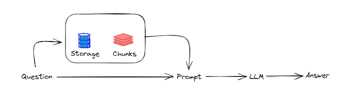

## Introduction

With a sudden rise in the popularity of Generative AI (GenAI) recently, the trending topic in every organization is to utilize the power of GenAI to augment business solutions offered to their clients. One of the most popular use cases for GenAI platforms is for providing a question and response interface. This might cover a wide range of topics or be limited to the relevant business information.

Large Language Models (LLMs) play a pivotal role within the realm of GenAI by harnessing vast datasets to understand and produce human-like text. As a cornerstone of natural language processing, LLMs utilize deep learning architectures to comprehend and generate coherent, contextually relevant text across various tasks. But there are limitations to it. For instance, the data LLM was trained on might be out of date or not too specific and a business might require responses to be based on their own specific data or information (example - issues or questions regarding technical documentation).

Retrieval-Augmented Generation (RAG) represents a paradigm shift in the capabilities of Language Models (LLMs). RAG based systems can integrate both generative and retrieval-based approaches to produce more contextually relevant and accurate outputs. Unlike traditional LLMs that rely solely on generating responses based on learned patterns from large datasets, RAG empowers models to access and incorporate information from external knowledge sources during the generation process. By leveraging this dual approach, LLMs can enhance the quality and specificity of their outputs thereby bridging the gap between pre-existing knowledge and generative capabilities.

## RAG Overview

An overview of RAG concept internal working is shown below. When a question is received from a user, it is first run over a vector store of the documents to fetch the most relevant chunks of information which is appended to the prompt being sent to the LLM. This provides the additional context to assist the LLMs to generate a more accurate and contextually relevant response.

## RAG Implementation

Let us delve into the practical implementation details of a RAG system utilizing OpenAI's LLM and LangChain, a versatile framework tailored for LLM-related tasks using Python. Beginning with the preprocessing of a PDF document to extract relevant textual data, one can seamlessly integrate LangChain's interface with OpenAI's API, facilitating efficient communication with the LLM.



#### 1. Prerequisites

- Ensure Python version 3.8 or higher is installed.
- Create an OpenAI account and set up an OpenAI API key which will be required in order to connect to the OpenAI API endpoints.
<<<<<<< Updated upstream
  - Account signup process: [https://platform.openai.com/signup](https://platform.openai.com/signup).
  - Steps required to create the AP key: [https://www.maisieai.com/help/how-to-get-an-openai-api-key-for-chatgpt](https://www.maisieai.com/help/how-to-get-an-openai-api-key-for-chatgpt)
  - Note - OpenAI might provide some credits that can be utilized initially but will require a payment method to continue using after the free credits expire.
=======
- Account signup process: [https://platform.openai.com/signup](https://platform.openai.com/signup).
- Steps required to create the AP key: [https://www.maisieai.com/help/how-to-get-an-openai-api-key-for-chatgpt](https://www.maisieai.com/help/how-to-get-an-openai-api-key-for-chatgpt)
- Note - OpenAI might provide some credits that can be utilized initially but will require a payment method to continue using after the free credits expire.

<!-- </br> -->
>>>>>>> Stashed changes

#### 2. Install Dependencies

-Install the required dependencies for performing RAG over a pdf document. OpenAI is used as the LLM in this example.

```
pip install langchain pypdf faiss-cpu openai tiktoken
```

#### 3. OpenAI API Key

The API key obtained earlier needs to be set up here in this step.

```
import os

os.environ["OPENAI_API_KEY"]= "...."
```

#### 4. Import Packages

Import all the required packages. OpenAI is used for embedding the documents, which will create the required vectorstore. In this case, FAISS vector database is utilized, other options such as Milvus, Pinecone, Redis can also be utilized for this purpose.

Import the load_qa_chain, which is an inbuilt, easy-to-use, question and answering chain that is provided by LangChain.

```
from langchain.document_loaders import PyPDFLoader
from langchain.embeddings import OpenAIEmbeddings
from langchain.vectorstores import FAISS
from langchain.chains.question_answering import load_qa_chain
from langchain.llms import OpenAI
```

#### 5. Load and Split Document

Load the pdf document and split the document using the following. Once the documents are loaded, they are split into smaller, manageable units such as paragraphs, sentences, or even smaller chunks depending on the granularity required. This splitting process facilitates efficient retrieval of specific information during the generation phase. Each unit is indexed or tagged to enable the LLM to quickly access and retrieve the relevant information based on the context of the input query or prompt.

```
loader = PyPDFLoader("path to document")
pages = loader.load_and_split()
```

#### 6. Create Embeddings

Initialize the embedding model in order to create the vectorstore. Here text-embedding-ada-002 (a model provided by OpenAI) is being used. There are also other embedding models available with different LLM's. The split documents are then passed as input to create the vectorstore using the FAISS vector database.

```
embeddings = OpenAIEmbeddings(model="text-embedding-ada-002")
db = FAISS.from_documents(pages, embeddings)
```

#### 7. RAG Implementation

The question and response chain is then initialized. The parameters to the OpenAI (example: temperature) to define the creativity of responses, model name etc. are passed in during initialization. A similarity search is then carried out over the vector database created earlier which would result in a set of chunked data that is similar to the user query. The chain is then invoked using chain.run while passing the retrieved documents and the user query as an input.

```
chain = load_qa_chain(OpenAI(temperature=0), chain_type="stuff")
query = "What is type 2 diabetes?"
docs = db.similarity_search(query)
chain.run(input_documents=docs, question=query)
```

### Conclusion

This blog is a basic discussion of the RAG concept utilizing LangChain alongside OpenAI's LLM. While developing such question and response systems, it is important to ensure integrity and precision of generated responses. Care should be taken to avoid any responses or outputs providing misinformation or direction toward potentially dubious courses of action.

While the RAG framework has been successfully deployed, it's crucial to acknowledge the inherent susceptibility of LLMs to generate inaccuracies or "hallucinations." These may manifest as extraneous information beyond the document's scope, factual inaccuracies, or inconsistencies within the responses themselves.

We will dive deeper into strategies for mitigating these limitations through prompt engineering in an upcoming blog post. It will also explore innovative approaches to fortifying the resilience of chatbot implementations, ensuring that they provide reliable, contextually appropriate responses while upholding the highest standards of accuracy and integrity.

### References

[LangChain](https://www.langchain.com/)

[OpenAI API](https://openai.com/blog/openai-api/)
