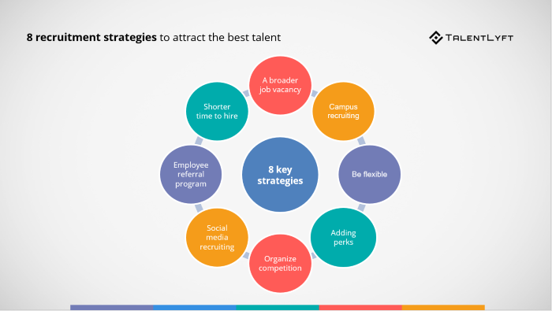

## **Recruitment Strategies for Technology professionals in a competitive job market**

In today's competitive job market, the demand for skilled IT professionals is relatively high. As an HR leader, I want to share some insights and strategies for recruiting competent IT professionals while addressing the challenges that come with it.

Hiring IT professionals across various domains requires HR professionals to constantly learn and adapt to the evolving landscape of technology and industry-specific needs. I have faced multiple challenges in hiring fresh graduates and software engineers to match our full stack development, DevSecOps and test automation needs. To start off, I had limited knowledge and experience in these areas, and understanding the technical aspects of these roles required a significant learning curve. I have had to get myself acquainted with this domain to effectively evaluate and screen qualified candidates. However, I knew that to keep up with the rapidly changing technology landscape, I had to adapt and broaden my skill set. This meant constantly educating myself on different domains that my company supported, listening to podcasts and webinars, and seeking mentorship from experts in this field. By making a concerted effort to learn and adjust, I have been able to successfully collaborate with our current technical staff to constantly improve our hiring practices for technology roles.

### **Introduction**

In a competitive job market, recruitment strategies play a crucial role in attracting top talent and staying ahead of the competition. Companies must be proactive in identifying the skills and qualities they are looking for in candidates, and tailor their recruitment efforts accordingly. This may involve leveraging social media platforms, attending job fairs, networking events, and utilizing employee referrals. Additionally, offering competitive salaries and benefits, opportunities for growth and advancement, and a positive work culture can help to attract and retain top talent in a competitive job market. By developing a strong employer brand and being strategic in their recruitment efforts, companies can ensure that they can attract the best candidates and maintain a competitive edge in the job market.

This blog outlines a comprehensive recruitment strategy for hiring new employees. The strategy includes several key components, such as utilizing online job boards, social media platforms, and networking events to attract potential candidates. Additionally, the idea should be to implement targeted advertising campaigns in order to reach a wider audience and entice competent professionals individuals to apply. The recruitment process has to be streamlined and efficient, with clear job descriptions and requirements outlined to attract the right candidates. The strategy will be implemented immediately, with recruitment efforts beginning as soon as possible. Various recruitment events will be scheduled in different locations to reach a diverse pool of candidates. Overall, the goal of this recruitment strategy is to build a strong and talented team that will contribute to the overall success of the organization.

While sourcing IT professionals from various domains, I have come across a variety of candidates ranging from experienced professionals to fresh graduates looking to break into the industry. I have utilized a combination of traditional recruitment techniques such as job postings on job boards and social media platforms, as well as more targeted methods like networking via LinkedIn and employee referrals to attract potential candidates. In my experience, candidates with strong fundamental skills, a growth mindset, adapt to new technologies/recent trends, and in-depth knowledge of the basics of a particular domain tend to stand out among the rest. Additionally, candidates who showcase a willingness to continuously learn and adapt to new technologies tend to be more successful in the recruitment process. In our observations,  a candidate with the right attitude always pays off in the long term.

One strategy that has worked well for me in sourcing technology professionals is reaching out to passive candidates through personalized messages highlighting their relevant skills and experiences. This approach has helped me connect with candidates who may not be actively searching for job opportunities but are open to exploring new opportunities. On the other hand, relying solely on job postings has not always yielded the best results as the competition for talented candidates is fierce and candidates may overlook postings that do not stand out.

Overall, I have found that building relationships with candidates and staying up-to-date on industry trends and technologies are crucial in successfully hiring engineering professionals. By understanding the unique skill set and mindset required for this role, I have been able to more effectively attract and engage top talent in the field.

### **Why does attitude matter?**

- **Access to a diverse talent pool:** By actively recruiting technology professionals, organizations can tap into a diverse pool of candidates with varying levels of expertise and experience. This allows them to select the best fit for their team and drive innovation.
- **Fosters a culture of continuous learning:** Hiring technology professionals who are eager to learn and grow can help create a culture of continuous learning within the organization. By investing in their development and providing growth opportunities, companies can build a team of skilled professionals who are constantly evolving and adapting to new technologies and practices.
- **Drives innovation and creativity:** Bringing in developers/architects who can inject new ideas, perspectives, and approaches into the team. Their fresh perspective can fuel innovation and creativity, leading to new solutions and improvements in processes and workflows. This diversity of thought can ultimately drive the company forward and keep it competitive in the rapidly changing tech industry.

### **Conclusion**

To successfully navigate a competitive technology job market and hire talented professionals, several key actions need to be taken.

- Firstly, the recruitment team should work closely with the hiring leads to define the job requirements and expectations for the role clearly. This will help attract candidates who possess the necessary skills and experience for the position.
- Additionally, leveraging online job boards and professional networking sites can help reach a larger pool of qualified candidates. It is also important for the organization to offer competitive salaries and benefits packages to attract and retain top talent.
- Finally, conducting thorough interviews and assessments to assess a candidate's technical skills, cultural fit, and communication abilities is essential in the hiring process.

Ultimately, the responsibility of defining recruitment strategies for hiring talented professionals falls on the recruitment team, hiring managers, and the Human Resources department to ensure a successful recruitment process. While the process may differ based on the company, the fundamentals remain the same!

### **References**

- https://www.talentlyft.com/en/blog/article/211/8-recruitment-strategies-to-attract-the-best-talent

- https://www.sutisoft.com/blog/best-strategies-effective-hr-recruiting/
