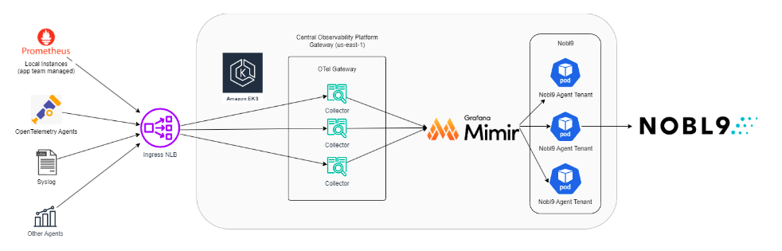

# **Managing SLIs and SLOs using Nobl9 Reliability Center**

## **Introduction**

Nobl9 Reliability Center (Nobl9) is a SaaS platform that provides a common understanding of service performance from business to technical stakeholders alike. Nobl9 typically resides on top of the current monitoring environment allowing organizations to set Service Level Objectives (SLOs) and track error budgets across all platforms and applications. Nobl9 attempts to bring visibility to these occurrences, empowering product teams to quickly identify and bring attention to issues that don’t cause an outage but that negatively impact their users’ experience. Nobl9 also allows organizations to define and monitor Service Level Indicators (SLIs) that accurately reflect the performance and reliability of their services. By transforming these SLIs into actionable SLOs, Nobl9 provides a clear and concise framework for making data-driven decisions that improve the quality of service delivered to customers. 

## **What are SLIs and SLOs?** 
SLIs are quantitative measures that reflect the performance and health of a service. They are derived from the metrics, logs, and traces generated by the underlying system and provide a clear and objective view of how well the specific service is functioning. \
 \
SLOs, on the other hand, are the targets or goals set for each SLI. They represent the desired level of performance that the service should achieve to meet customer expectations and business objectives.

 **Metric Data -> SLOs**  \
KansoCloud integrated Nobl9 with the current Observability Platform (built on the OpenTelemetry suite) for one of our customers. This Observability Platform allows multiple application teams to send metrics, traces, and logs to a central location to address different needs such as storage, data visualizations, and alerting. The newly developed Nobl9 integration works each application’s Prometheus instance to collect metrics and provide a dataset that reflects the performance and health of the service’s infrastructure. It ingests the metrics and transforms them into meaningful SLOs. It thereby enables consumers to define SLOs based on the metrics that matter most to their business and their end customers. 

**Nobl9 Implementation and Capabilities** \
The Nobl9 agent deployment will ingest metrics from multiple tenants, including the configuration of an HTTP header environment variable which can be set to store compartmentalize metrics from different applications teams (tenants) and separate them into their distinct spaces. \
 \
Example: \
 \
**<code>env:** \
 name: HTTP_HEADER</code></strong> \
<code> value: tenant_id</code></strong>

**Deployment Details** \
The Nobl9 agent deployment process was configured to be self-service by modifying the Observability Platform’s onboarding pipeline to include specific values for the Nobl9 agent's client ID and client secret which users can obtain from the auto-generated Kubernetes deployment file through the Nobl9 UI. This information is then used to dynamically generate the appropriate Kubernetes deployment configuration. An additional parameter is also configured, allowing the user to opt-in for deployment. If opted-in, the pipeline uses the provided credentials to set up the Nobl9 agent securely. This approach gives users more control and flexibility during the onboarding process, allowing them to easily deploy the Nobl9 agent with their specific configuration or skip the deployment if desired. 

## **Conclusion** 
Nobl9’s ability to sit on top of your existing observability infrastructure allows it to seamlessly integrate with and improve the ways in which you can transform your observability data into meaningful insights that alert in real-time and ensure reliability in performance across your entire stack.
