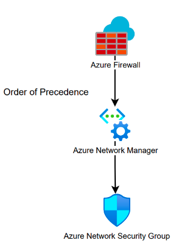

### **Introduction**

In the rapidly evolving landscape of cloud computing, managing network infrastructure efficiently is paramount for businesses striving for digital transformation. Enter Azure Network Manager, Microsoft's comprehensive solution designed to simplify and streamline network management in the Azure cloud environment. In this blog post, we'll delve into the capabilities of **Azure Network Manager** and explore how it empowers organizations to optimize their network operations while enhancing security and reliability.

### **The Challenge of Cloud Network Management**

As businesses increasingly migrate their workloads to the cloud, they are confronted with the complexities of managing diverse network environments spanning multiple regions and services. Traditional networking approaches often struggle to keep pace with the dynamic nature of cloud infrastructure, leading to operational inefficiencies, security vulnerabilities, and compliance risks.

**Azure Network Manager** \
Azure Network Manager offers a centralized platform for configuring, monitoring, and troubleshooting Azure network resources. With its intuitive interface and powerful features, Azure Network Manager enables organizations to gain full visibility and control over their network infrastructure, regardless of scale or complexity.

**Key Features and Benefits**

- Centralized Management - Azure Network Manager provides a unified dashboard for managing virtual networks, gateways, and other networking components across Azure regions. This centralized approach simplifies administrative tasks, reducing the time and effort required to configure and maintain network resources.
- Simple Automated Provisioning - Azure Resource Manager (ARM) and Terraform IaC scripts are great for network provisioning but demand a specific skillset. Azure Network Manager automates the deployment of virtual networks and connectivity services, enabling rapid scaling and provisioning of resources to meet evolving business needs.
- Enhanced Security - Security is a top priority in the cloud era, and Azure Network Manager incorporates advanced security features to safeguard network traffic and data. From network segmentation to encryption and threat detection, organizations can leverage Azure Network Manager to enforce robust security policies and mitigate risks effectively.
- Intelligent Monitoring and Insights - Azure Network Manager offers real-time monitoring and diagnostics capabilities, allowing organizations to identify and troubleshoot network issues proactively. With built-in analytics and reporting tools, administrators can gain valuable insights into network performance and utilization, enabling informed decision-making and optimization.
- Seamless Integration - Built on Azure's underlying infrastructure, Azure Network Manager seamlessly integrates with other Azure services and third-party solutions, providing a cohesive networking ecosystem for diverse workloads and applications. Whether deploying virtual machines, containers, or IoT devices, organizations can leverage Azure Network Manager to ensure seamless connectivity and interoperability.

**Practical Implementation** \
While there are many features available in Azure Network Manager, one particular feature stands out for us to ease the burden of managing Network Security Groups (NSG). When all NSG’s require a rule for activities such as Windows or Linux updates and those rules need to be updated, they must be created or updated on each individual NSG.

Using Azure Network Manager, one can create Security Admin Rules that apply to all NSG’s and can take precedence over NSG rules. Security Admin Rules can also be used to isolate specific networks such as the separation of Production and Development networks while still allowing both to reach a management network and not having to update route tables or firewall rules (who has time to wait 5 min per network firewall update). In our use case, it has been utilized to provide the development teams with more autonomy by allowing them to add or remove their NSG rules as they see fit while preventing them from creating overall security risks.

### **Conclusion**

Azure Network Manager represents a paradigm shift in cloud network management in Azure, empowering organizations to optimize performance, enhance security, and drive innovation in the digital age. By centralizing management, automating provisioning, and delivering advanced security and monitoring capabilities, Azure Network Manager enables businesses to unleash the full potential of their Azure infrastructure while staying agile and resilient in a dynamic cloud landscape.
